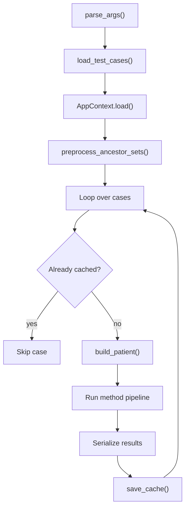

# Batch Runners and Shared Utilities

## Purpose

The batch runners execute RareSim similarity methods on every test case in a benchmark dataset.

Each runner follows the same general workflow:

```text
1. Load benchmark test cases.
2. Load shared RareSim artifacts through AppContext.
3. Build a PatientProfile for each case.
4. Run one method group.
5. Serialize the results.
6. Save the results into per-case cache files.
```

The shared helper file is:

```text
scripts/evaluation/_batch_utils.py
```

The main runner files are:

```text
scripts/evaluation/run_set_based.py
scripts/evaluation/run_semantic.py
scripts/evaluation/run_tfidf.py
scripts/evaluation/run_hpo2vec.py
scripts/evaluation/run_autoencoder.py
scripts/evaluation/run_transformer.py
scripts/evaluation/run_llm.py
```

---

## `_batch_utils.py`

`_batch_utils.py` contains helper functions used by the evaluation runners.

Its main responsibilities are:

```text
Load test cases.
Build PatientProfile objects.
Create cache paths.
Load existing cache files.
Save and merge cache files.
Check whether methods are already cached.
Serialize result objects to dictionaries.
Print progress and summary messages.
Define common command-line arguments.
```

Main functions:

```python
load_test_cases(path)
build_patient(index, hpo_terms, ancestor_sets)
cache_path_for(cache_dir, index)
load_cache(path)
save_cache(...)
methods_already_cached(cache_file, required_methods)
serialize_results(results)
print_header(...)
print_case(...)
print_case_ok(...)
print_case_err(...)
print_summary(...)
add_common_args(parser)
```

---

## Method Groups

Some method groups are defined in `_batch_utils.py`.

Semantic methods:

```python
SEMANTIC_METHODS = [
    "semantic_resnik_bma",
    "semantic_lin_bma",
    "semantic_jiang_conrath_bma",
]
```

Set-based methods:

```python
SET_BASED_METHODS = [
    "set_cosine",
    "set_jaccard",
    "set_dice",
    "set_overlap",
]
```

TF-IDF methods:

```python
TFIDF_METHODS = ["tfidf"]
```

CPU method group:

```python
CPU_METHODS = SEMANTIC_METHODS + SET_BASED_METHODS + TFIDF_METHODS
```

Other runners get their method names from their own pipeline or config files:

```text
run_semantic.py      uses ALL_METHODS
run_transformer.py   uses MODEL_LIST
run_llm.py           uses LLM_MODEL_LIST
```

These names are used as keys in the evaluation cache files.

---

## Test Case Loading

Function:

```python
load_test_cases(path)
```

Expected test set format:

```json
[
  [
    ["HP:0001263", "HP:0001250"],
    ["ORPHA:123"]
  ],
  [
    ["HP:0004322", "HP:0000252"],
    ["OMIM:123456", "ORPHA:999"]
  ]
]
```

The loader returns:

```text
list[tuple[list[str], list[str]]]
```

Each tuple contains:

```text
(hpo_terms, ground_truth)
```

where:

```text
hpo_terms
    The patient phenotype terms.

ground_truth
    The expected disease identifiers for the test case.
```

---

## Patient Construction

Function:

```python
build_patient(index, hpo_terms, ancestor_sets)
```

This function creates a `PatientProfile` for one evaluation case.

The created object has this structure:

```python
PatientProfile(
    patient_id=f"eval_case_{index:04d}",
    raw_text="",
    hpo_terms=raw_terms,
    propagated_hpo_terms=propagated,
)
```

The direct terms are the HPO terms from the test case.

The propagated terms are built by adding HPO ancestors:

```python
get_ancestors_inclusive(term, ancestor_sets)
```

The result is a patient representation containing:

```text
hpo_terms
    Direct HPO terms from the benchmark case.

propagated_hpo_terms
    Direct HPO terms plus ancestor terms from the HPO hierarchy.
```

The same patient representation is used across the method runners so that method comparisons are based on consistent input.

---

## Common Command-Line Arguments

All runners use:

```python
add_common_args(parser)
```

Common arguments:

```text
--test-set
    Path to the benchmark JSON file.

--no-resume
    Rerun cases even if cached results already exist.

--limit
    Process only the first N cases.

--top-k
    Number of top-ranked results to keep per method.
```

Example:

```bash
python scripts/evaluation/run_set_based.py \
    --test-set data/datasets/phenobrain_testdata/MME.json \
    --limit 10 \
    --top-k 10
```

---

## Generic Runner Pattern



---

## Cache Structure

Each case is saved as a separate cache file:

```text
outputs/evaluation/{test_set_name}/cache/case_XXXX.json
```

Example:

```text
outputs/evaluation/MME/cache/case_0000.json
```

Each cache file stores:

```text
case index
input HPO terms
ground-truth disease IDs
method results
method runtime
total runtime
```

The cache makes it possible to resume a run without recomputing methods that are already available.

---

## `run_set_based.py`

Purpose:

```text
Runs set-based similarity methods on every test case.
```

Methods:

```text
set_cosine
set_jaccard
set_dice
set_overlap
```

Workflow:

```text
1. Load test cases.
2. Load AppContext.
3. Preprocess HPO ancestor sets.
4. Build a PatientProfile for each case.
5. Run all set-based methods.
6. Serialize the results.
7. Save results into the evaluation cache.
```

Set-based methods compare patient and disease HPO term sets directly.

The runner also records runtime information. Since all set-based methods are run together, the total case runtime can be split across the method names for reporting.

Command:

```bash
python scripts/evaluation/run_set_based.py \
    --test-set data/datasets/phenobrain_testdata/MME.json
```

---

## `run_semantic.py`

Purpose:

```text
Runs semantic similarity methods on every test case.
```

Methods come from:

```python
ALL_METHODS
```

in:

```text
raresim/similarity_methods/semantic/pipeline.py
```

Semantic methods use HPO structure and information content.

Typical methods:

```text
semantic_resnik_bma
semantic_lin_bma
semantic_jiang_conrath_bma
```

Workflow:

```text
1. Load test cases.
2. Load AppContext.
3. Preprocess HPO ancestor sets.
4. Build a PatientProfile for each case.
5. Run semantic methods.
6. Time each method.
7. Serialize the results.
8. Save results into the evaluation cache.
```

Specific argument:

```text
--ic-threshold
```

Default:

```text
1.5
```

Command:

```bash
python scripts/evaluation/run_semantic.py \
    --test-set data/datasets/phenobrain_testdata/MME.json \
    --ic-threshold 1.5
```

---

## `run_tfidf.py`

Purpose:

```text
Runs the TF-IDF similarity method on every test case.
```

Method:

```text
tfidf
```

Pipeline call:

```python
run_tfidf(patient, TFIDF_METHODS, config, ctx)
```

TF-IDF represents HPO terms as weighted features and ranks diseases by vector similarity.

Workflow:

```text
1. Load test cases.
2. Load AppContext.
3. Preprocess HPO ancestor sets.
4. Build a PatientProfile for each case.
5. Run TF-IDF.
6. Serialize the results.
7. Save results into the evaluation cache.
```

Command:

```bash
python scripts/evaluation/run_tfidf.py \
    --test-set data/datasets/phenobrain_testdata/MME.json
```

---

## `run_hpo2vec.py`

Purpose:

```text
Runs HPO2Vec on every test case.
```

Method:

```text
hpo2vec
```

Model path:

```python
MODEL_PATH = MODELS_DIR / "hpo2vec_model"
```

HPO2Vec uses vector representations of HPO terms and compares patient and disease profiles in embedding space.

Workflow:

```text
1. Load test cases.
2. Load AppContext.
3. Preprocess HPO ancestor sets.
4. Build a PatientProfile for each case.
5. Load the HPO2Vec model.
6. Run HPO2Vec ranking.
7. Serialize the results.
8. Save results into the evaluation cache.
```

The runner warns if the model file is missing.

Command:

```bash
python scripts/evaluation/run_hpo2vec.py \
    --test-set data/datasets/phenobrain_testdata/MME.json
```

---

## `run_autoencoder.py`

Purpose:

```text
Runs the denoising autoencoder on every test case.
```

Method:

```text
denoising_autoencoder
```

Model cache:

```text
outputs/similarity_methods/autoencoder/model_cache/autoencoder.npz
```

The autoencoder learns latent phenotype representations from disease HPO profiles. During evaluation, it encodes the patient and diseases into latent vectors and ranks diseases by cosine similarity.

Workflow:

```text
1. Load test cases.
2. Load AppContext.
3. Preprocess HPO ancestor sets.
4. Load or train the autoencoder model.
5. Pre-encode disease profiles into normalized latent vectors.
6. Build a PatientProfile for each case.
7. Encode the patient case.
8. Rank diseases by latent-space cosine similarity.
9. Save serialized results into the evaluation cache.
```

Specific argument:

```text
--retrain
```

This removes the saved model and vocabulary and trains the autoencoder again.

Command:

```bash
python scripts/evaluation/run_autoencoder.py \
    --test-set data/datasets/phenobrain_testdata/MME.json
```

Retrain command:

```bash
python scripts/evaluation/run_autoencoder.py \
    --test-set data/datasets/phenobrain_testdata/MME.json \
    --retrain
```

---

## `run_transformer.py`

Purpose:

```text
Runs transformer-based disease retrieval models on every test case.
```

Models come from:

```python
MODEL_LIST
```

defined in:

```text
raresim/similarity_methods/transformer/config.py
```

The runner uses:

```python
DiseaseRetriever
```

Transformer models encode patient and disease text representations and rank diseases using embedding similarity.

Workflow:

```text
1. Load test cases.
2. Load HPO labels.
3. Load alias-to-canonical disease mappings.
4. Load AppContext.
5. Preprocess HPO ancestor sets.
6. Build DiseaseRetriever.
7. Prepare the transformer embedding cache.
8. Build a PatientProfile for each case.
9. Rank diseases with each model in MODEL_LIST.
10. Serialize the results.
11. Save each model result list under its model name in the cache.
```

Command:

```bash
CUDA_VISIBLE_DEVICES=5 python scripts/evaluation/run_transformer.py \
    --test-set data/datasets/phenobrain_testdata/MME.json
```

With limit:

```bash
CUDA_VISIBLE_DEVICES=5 python scripts/evaluation/run_transformer.py \
    --test-set data/datasets/phenobrain_testdata/MME.json \
    --limit 10 \
    --top-k 10
```

---

## `run_llm.py`

Purpose:

```text
Runs direct LLM disease retrieval on every test case.
```

Models come from:

```python
LLM_MODEL_LIST
```

defined in:

```text
raresim/similarity_methods/llm/config.py
```

The LLM runner asks a generative biomedical model to retrieve candidate rare diseases from the patient phenotype profile.

Workflow:

```text
1. Load test cases.
2. Load HPO labels.
3. Load AppContext.
4. Preprocess HPO ancestor sets.
5. Load one LLM model.
6. Build a PatientProfile for each case.
7. Build a retrieval prompt from the patient profile.
8. Query the model.
9. Parse the generated disease retrieval output.
10. Serialize the results.
11. Save results into the evaluation cache.
12. Unload the model before moving to the next model.
```

Command:

```bash
CUDA_VISIBLE_DEVICES=5 python scripts/evaluation/run_llm.py \
    --test-set data/datasets/phenobrain_testdata/MME.json
```

With limit:

```bash
CUDA_VISIBLE_DEVICES=5 python scripts/evaluation/run_llm.py \
    --test-set data/datasets/phenobrain_testdata/MME.json \
    --limit 10 \
    --top-k 10
```