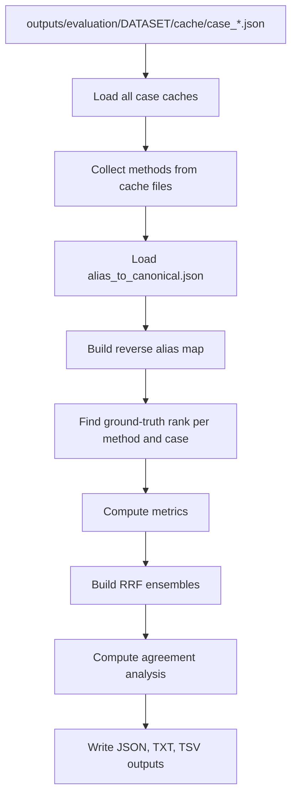

# Evaluator and Metrics

## Purpose

The evaluator reads cached case results and computes evaluation metrics for all detected methods.

File:

```text
scripts/evaluation/evaluator.py
```

The evaluator does not rerun methods. It only reads cache files.

Input:

```text
outputs/evaluation/<DATASET>/cache/case_*.json
```

Outputs:

```text
outputs/evaluation/<DATASET>/<DATASET>_evaluation.json
outputs/evaluation/<DATASET>/<DATASET>_evaluation_summary.txt
outputs/evaluation/<DATASET>/<DATASET>_stats.txt
outputs/evaluation/<DATASET>/<DATASET>_summary.tsv
```

Command:

```bash
python scripts/evaluation/evaluator.py --dataset MME
```

---

## Evaluator workflow



---

## Method detection

The evaluator automatically detects methods from:

```python
case.get("results", {}).keys()
```

Therefore, a new method does not need evaluator changes if it writes results in the expected cache format.

---

## Disease ID matching

The evaluator can extract disease IDs from:

```text
disease_id
canonical_disease_id
ordo_id
```

Function:

```python
get_disease_id_from_result(result)
```

This supports different method families:

```text
semantic / set-based / tfidf / hpo2vec / autoencoder
transformer
llm
```

---

## Alias matching

The evaluator loads:

```text
alias_to_canonical.json
```

from:

```text
outputs/artifacts/
```

It builds a reverse alias map so equivalent disease IDs can match.

Example:

```text
Ground truth:
    OMIM:123456

Method result:
    ORPHA:999

alias_to_canonical:
    OMIM:123456 -> ORPHA:999
```

This should count as correct because both IDs refer to the same disease concept.

Main functions:

```python
load_alias_map()
build_reverse_map(alias_map)
get_all_equivalent_ids(disease_id, alias_map, reverse_map)
find_rank(...)
```

---

## Rank finding

For each case and method, the evaluator finds the best rank of any ground-truth disease.

Function:

```python
find_rank(ground_truth_ids, results, alias_map, reverse_map)
```

Returns:

```text
rank number
    if a ground-truth disease or equivalent ID is found

None
    if no ground-truth disease is found
```

---

## Metrics

The evaluator computes:

```text
Recall@1
Recall@3
Recall@5
Recall@10
Recall@20
MRR
NDCG@10
Found count
Median rank
```

### Recall@k

Fraction of cases where a ground-truth disease appears within the top `k`.

### MRR

Mean Reciprocal Rank.

Examples:

```text
rank 1  -> 1.0
rank 2  -> 0.5
rank 10 -> 0.1
not found -> 0
```

### NDCG@10

Discounted rank score up to rank 10.

In this evaluator:

```text
1 / log2(rank + 1)
```

is used if the correct disease is found within the cutoff.

### Found count

Number of cases where the correct disease was found.

### Median rank

Median rank among found cases.

---

## Timing

Average runtime per method is computed from:

```text
method_elapsed_seconds
```

Function:

```python
aggregate_method_timing(cases)
```

If a method does not write timing information, metrics still work, but average runtime is unavailable.

---

## RRF ensembles

The evaluator builds Reciprocal Rank Fusion ensembles.

Formula:

```text
RRF(disease) = sum(weight_method / (k + rank_method(disease)))
```

Default:

```python
RRF_K = 60
```

Generated ensemble methods:

```text
ensemble_rrf
ensemble_rrf_weighted
ensemble_rrf_top
```

Meaning:

```text
ensemble_rrf
    Equal-weight RRF using all base methods.

ensemble_rrf_weighted
    RRF weighted by each method's Recall@10.

ensemble_rrf_top
    Equal-weight RRF using only methods whose Recall@10 is above the threshold.
```

Threshold:

```python
RRF_MIN_RECALL10 = 0.10
```

If no method passes the threshold, the evaluator falls back to all base methods.

---

## Method agreement analysis

The evaluator computes agreement statistics across methods:

```text
Consensus cases
    Cases where all methods found the correct disease.

Hard cases
    Cases where no method found the correct disease.

Easy cases
    Cases where at least one method ranked the correct disease #1.

Unique finds
    Cases where exactly one method found the correct disease.

Found-by-N distribution
    How many methods found the correct disease per case.

Rank histogram
    How often the correct disease was found at each rank.
```

This helps determine whether methods fail on the same cases or solve complementary cases.

---

## Output files

### `<DATASET>_evaluation.json`

Machine-readable result file.

Contains:

```text
n_cases
n_methods
methods
method_metrics
method_avg_seconds
rank_matrix
rrf_top_methods
rrf_method_weights
```

### `<DATASET>_evaluation_summary.txt`

Readable summary.

Contains:

```text
method comparison table
RRF configuration
method agreement analysis
per-case rank matrix
```

### `<DATASET>_stats.txt`

Compact method-level statistics.

### `<DATASET>_summary.tsv`

Tab-separated per-case summary.

Columns:

```text
method
case_id
n_hpo
confirmed_diseases
rank
matched_id
status
query_time_sec
```
