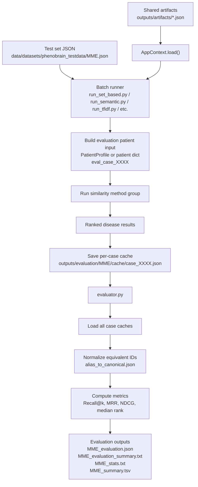

# Evaluation Workflow Overview

## Purpose

The evaluation workflow compares RareSim similarity methods on benchmark test sets.

Each test case contains:

```text
patient HPO terms
ground-truth disease IDs
```

Each batch runner processes every case, runs one group of similarity methods, and writes ranked results into per-case cache files.

The evaluator then reads those cache files and computes rank-based metrics.

## Evaluation comes after artifact building

Before evaluation, shared artifacts must already exist:

```bash
python scripts/setup/load_ontologies_to_local.py
python scripts/setup/build_shared_artifacts.py
```

The evaluation runners then load artifacts with:

```python
AppContext.load()
```

The evaluation workflow does not rebuild disease profiles, HPO ancestors, mappings, or information content. It reuses artifacts from:

```text
outputs/artifacts/
```

## Main workflow



## Output directory

The evaluation output directory is:

```text
outputs/evaluation/
```

It is defined in `_batch_utils.py` as:

```python
EVALUATION_DIR = OUTPUTS_DIR / "evaluation"
```

For a dataset file named:

```text
MME.json
```

the runner saves per-case caches under:

```text
outputs/evaluation/MME/cache/
```

because the dataset name is taken from:

```python
test_set_path.stem
```

## Full command order

```bash
python scripts/setup/load_ontologies_to_local.py
python scripts/setup/build_shared_artifacts.py

python scripts/evaluation/run_set_based.py --test-set data/datasets/phenobrain_testdata/MME.json
python scripts/evaluation/run_tfidf.py --test-set data/datasets/phenobrain_testdata/MME.json
python scripts/evaluation/run_semantic.py --test-set data/datasets/phenobrain_testdata/MME.json
python scripts/evaluation/run_hpo2vec.py --test-set data/datasets/phenobrain_testdata/MME.json
python scripts/evaluation/run_autoencoder.py --test-set data/datasets/phenobrain_testdata/MME.json

CUDA_VISIBLE_DEVICES=5 python scripts/evaluation/run_transformer.py --test-set data/datasets/phenobrain_testdata/MME.json
CUDA_VISIBLE_DEVICES=5 python scripts/evaluation/run_llm.py --test-set data/datasets/phenobrain_testdata/MME.json

python scripts/evaluation/evaluator.py --dataset MME
```

For quick testing:

```bash
python scripts/evaluation/run_set_based.py \
    --test-set data/datasets/phenobrain_testdata/MME.json \
    --limit 5

python scripts/evaluation/evaluator.py --dataset MME
```

## Evaluation outputs

For dataset `MME`, the evaluator writes:

```text
outputs/evaluation/MME/MME_evaluation.json
outputs/evaluation/MME/MME_evaluation_summary.txt
outputs/evaluation/MME/MME_stats.txt
outputs/evaluation/MME/MME_summary.tsv
```
