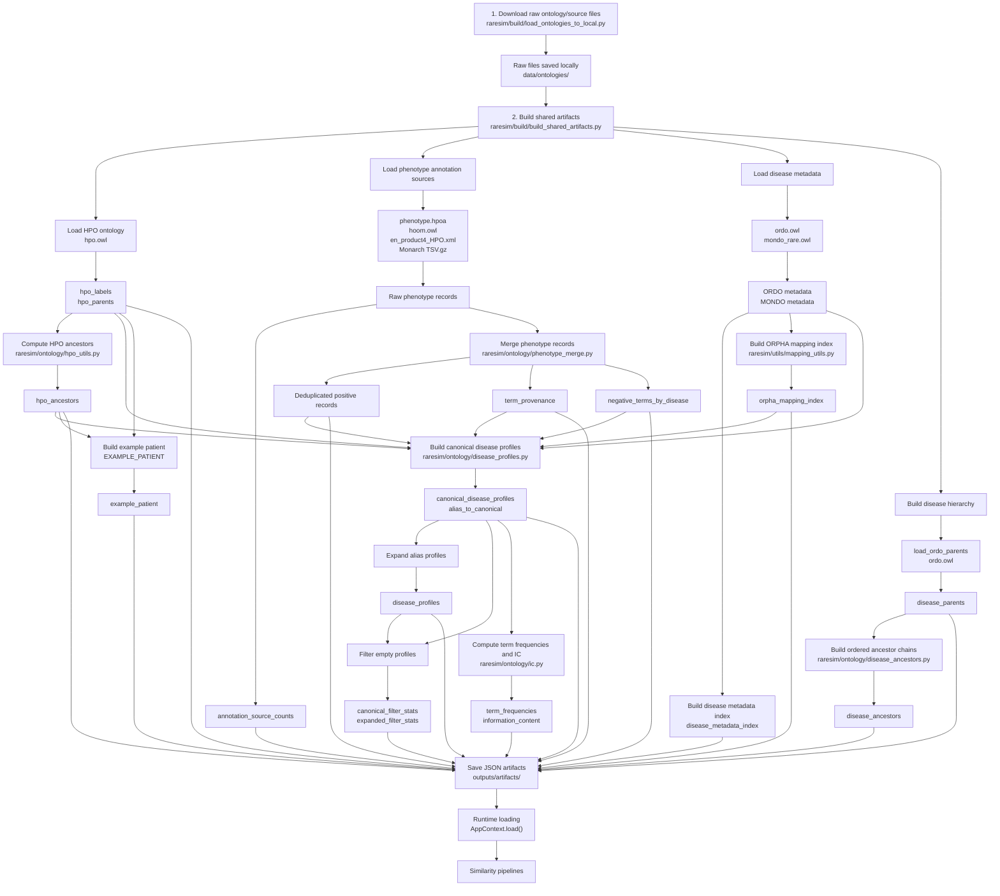

# Shared Artifact Workflow Figure



## Short interpretation

```text
raresim/build/load_ontologies_to_local.py
    ↓
downloads raw source files to data/ontologies/

raresim/build/build_shared_artifacts.py
    ↓
builds reusable JSON artifacts in outputs/artifacts/

AppContext.load()
    ↓
loads artifacts for similarity methods
```
