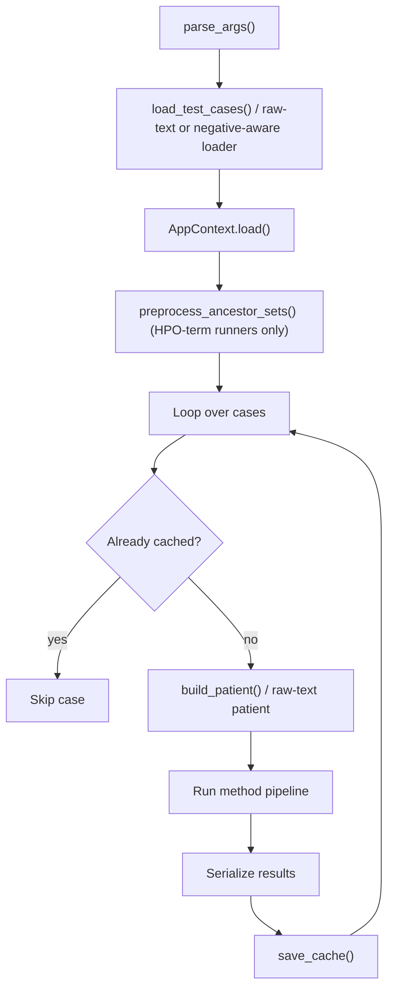

# Batch Runners and Shared Utilities

## Purpose

The batch runners execute RareSim similarity methods on every test case in a benchmark dataset.

Most runners follow the same general workflow:

```text
1. Load benchmark test cases (HPO-term cases, or raw-text cases for text-mode runners).
2. Load shared RareSim artifacts through AppContext.
3. Build a PatientProfile for each case.
4. Run one method group.
5. Serialize the results.
6. Save the results into per-case cache files.
```

The shared helper file is:

```text
scripts/evaluation/_batch_utils.py
```

The runner files are:

```text
scripts/evaluation/run_set_based.py
scripts/evaluation/run_set_jaccard_penalized.py
scripts/evaluation/run_semantic.py
scripts/evaluation/run_tfidf.py
scripts/evaluation/run_tfidf_text.py
scripts/evaluation/run_hpo2vec.py
scripts/evaluation/run_autoencoder.py
scripts/evaluation/run_transformer.py
scripts/evaluation/run_transformer_text.py
scripts/evaluation/run_llm.py
scripts/evaluation/run_llm_text.py
```

The `_text` runners (`run_tfidf_text.py`, `run_transformer_text.py`, `run_llm_text.py`) consume raw clinical text instead of HPO terms. `run_set_jaccard_penalized.py` consumes HPO terms plus an *excluded* HPO term list. See [Raw-text runners](#raw-text-runners) and [`run_set_jaccard_penalized.py`](#run_set_jaccard_penalizedpy) below.

---

## `_batch_utils.py`

`_batch_utils.py` contains helper functions used by the evaluation runners. Its main responsibilities are:

```text
Load test cases.
Build PatientProfile objects.
Create cache paths.
Load existing cache files.
Save and merge cache files.
Check whether methods are already cached.
Serialize result objects to dictionaries.
Print progress and summary messages.
Define common command-line arguments.
```

Functions referenced across runners:

```python
EVALUATION_DIR
load_test_cases(path)
load_raw_text_cases-style loaders  # each _text / negative-aware runner defines its own
build_patient(index, hpo_terms, ancestor_sets)
cache_path_for(cache_dir, index)
load_cache(path)
save_cache(...)
methods_already_cached(cache_file, required_methods)
serialize_results(results)
print_header(...)
print_case(...)
print_case_ok(...)
print_case_err(...)
print_summary(...)
add_common_args(parser)
```

Note: `load_raw_text_cases()` / `load_negative_aware_test_cases()` are **not** part of `_batch_utils.py` — each of the four non-standard runners (`run_tfidf_text.py`, `run_llm_text.py`, `run_transformer_text.py`, `run_set_jaccard_penalized.py`) implements its own loader and case dataclass locally, because each has a slightly different accepted schema. See [Test Case Loading](#test-case-loading) below.

---

## Method Names

Each similarity-method package exposes its own method identifiers, and the runner imports them directly rather than through a shared grouping in `_batch_utils.py`:

```text
run_set_based.py             METHOD_NAMES  from raresim.similarity_methods.set_based
run_set_jaccard_penalized.py METHOD_NAMES  from raresim.similarity_methods.set_based
                                            (only "set_jaccard_penalized" is run)
run_semantic.py              METHOD_NAMES  from raresim.similarity_methods.semantic
run_tfidf.py                 METHOD_NAMES  from raresim.similarity_methods.tfidf
run_tfidf_text.py            METHOD_NAMES  from raresim.similarity_methods.tfidf
                                            (auto-resolves the text-mode entry,
                                            normally "tfidf_text")
run_hpo2vec.py                METHOD_NAMES, PIPELINE_NAME, MODEL_CACHE_DIR
                                            from raresim.similarity_methods.hpo2vec
run_autoencoder.py            METHOD_NAME   from raresim.similarity_methods.autoencoder.pipeline
run_transformer.py            MODEL_LIST, CANDIDATE_POOL_SIZE
                                            from raresim.similarity_methods.transformer.config
run_transformer_text.py       MODEL_LIST, CANDIDATE_POOL_SIZE  (same config module)
run_llm.py                    LLM_MODEL_LIST, MAX_NEW_TOKENS_RETRIEVAL
                                            from raresim.similarity_methods.llm.config
run_llm_text.py               LLM_MODEL_LIST, MAX_NEW_TOKENS_RETRIEVAL  (same config module)
```

These identifiers are used verbatim as the keys under `results`, `method_elapsed_seconds`, and `methods_run` in the evaluation cache (see [cache-format.md](cache-format.md)), and therefore as the method names the evaluator reports.

---

## Test Case Loading

### Standard (HPO-term) format

Function:

```python
load_test_cases(path)
```

used by `run_set_based.py`, `run_semantic.py`, `run_tfidf.py`, `run_hpo2vec.py`, `run_autoencoder.py`, `run_transformer.py`, and `run_llm.py`.

Expected test set format:

```json
[
  [
    ["HP:0001263", "HP:0001250"],
    ["ORPHA:123"]
  ],
  [
    ["HP:0004322", "HP:0000252"],
    ["OMIM:123456", "ORPHA:999"]
  ]
]
```

The loader returns `list[tuple[list[str], list[str]]]`. Each tuple is `(hpo_terms, ground_truth)`, where `hpo_terms` are the patient phenotype terms and `ground_truth` are the expected disease identifiers for the case.

### Raw-text format

Used by `run_tfidf_text.py`, `run_llm_text.py`, and `run_transformer_text.py`. Each implements the same accepted shapes locally (`_load_mapping_cases` / `_load_object_cases` / `load_raw_text_cases`):

**Disease-to-text mapping:**

```json
{
  "ORPHA:123": "Clinical description...",
  "456": "Another clinical description..."
}
```

A bare numeric key like `"456"` is normalized to `ORPHA:456`.

**List of case objects:**

```json
[
  {
    "id": "case_0000",
    "raw_text": "Clinical description...",
    "disease_codes": ["ORPHA:123"]
  }
]
```

Accepted field aliases:

```text
Text        : raw_text, text, clinical_text, description
Ground truth: disease_codes, ground_truth, disease_id, disease_code, orpha_code
```

Ground truth may be a single string or a list of strings; it is normalized to a sorted, de-duplicated list. `id` is optional and defaults to `case_{index:04d}`.

### Negative-aware format

Used only by `run_set_jaccard_penalized.py`:

```json
[
  {
    "hpo_terms": ["HP:0001263", "HP:0001250"],
    "excluded_hpo_terms": ["HP:0000750"],
    "disease_codes": ["ORPHA:123"]
  }
]
```

`hpo_terms` and `disease_codes` are required and non-empty; `excluded_hpo_terms` is optional and may be empty.

---

## Patient Construction

Function:

```python
build_patient(index, hpo_terms, ancestor_sets)
```

Used by every HPO-term runner. Creates a `PatientProfile` for one evaluation case:

```python
PatientProfile(
    patient_id=f"eval_case_{index:04d}",
    raw_text="",
    hpo_terms=raw_terms,
    propagated_hpo_terms=propagated,
)
```

The direct terms are the HPO terms from the test case. The propagated terms are the direct terms plus their HPO ancestors, via `get_ancestors_inclusive(term, ancestor_sets)`.

Raw-text runners instead build a `PatientProfile` directly with `raw_text` set and empty `hpo_terms` / `propagated_hpo_terms` sets — there is no shared helper for this since the shape is simple.

`run_set_jaccard_penalized.py` builds on top of `build_patient()` and adds the excluded terms:

```python
PatientProfile(
    patient_id=base_patient.patient_id,
    raw_text=base_patient.raw_text,
    hpo_terms=set(base_patient.hpo_terms),
    propagated_hpo_terms=set(base_patient.propagated_hpo_terms),
    excluded_hpo_terms=set(case.excluded_hpo_terms),
)
```

The same patient representation is used across the method runners so that method comparisons are based on consistent input.

---

## Common Command-Line Arguments

All runners use:

```python
add_common_args(parser)
```

Common arguments:

```text
--test-set
    Path to the benchmark JSON file.

--no-resume
    Rerun cases even if cached results already exist.

--limit
    Process only the first N cases.

--top-k
    Number of top-ranked results to keep per method.
```

Several runners add their own arguments on top of these — see each runner's section below.

Example:

```bash
python scripts/evaluation/run_set_based.py \
    --test-set data/datasets/phenobrain_testdata/MME.json \
    --limit 10 \
    --top-k 10
```

---

## Generic Runner Pattern



---

## Cache Structure

Each case is saved as a separate cache file:

```text
outputs/evaluation/{cache_name}/cache/case_XXXX.json
```

`{cache_name}` defaults to the test-set filename stem (`test_set_path.stem`), but several runners accept `--cache-name` to write into an existing dataset's cache instead — see [`run_tfidf_text.py`](#run_tfidf_textpy), [`run_llm_text.py`](#run_llm_textpy), [`run_transformer_text.py`](#run_transformer_textpy), and [`run_set_jaccard_penalized.py`](#run_set_jaccard_penalizedpy).

Example:

```text
outputs/evaluation/MME/cache/case_0000.json
```

Each cache file stores case index, input HPO terms (or raw text), ground-truth disease IDs, method results, method runtime, and total runtime. Full field reference: [cache-format.md](cache-format.md).

The cache makes it possible to resume a run without recomputing methods that are already available (see `--no-resume` in [cache-format.md](cache-format.md)).

---

## `run_set_based.py`

Purpose: runs all registered set-based similarity methods (imported as `METHOD_NAMES` from `raresim.similarity_methods.set_based`) on every test case, timing each method separately within the case.

Workflow:

```text
1. Load test cases.
2. Load AppContext.
3. Preprocess HPO ancestor sets.
4. Build a PatientProfile for each case.
5. Run each set-based method one at a time (own timer per method).
6. Serialize the results.
7. Save results into the evaluation cache.
```

Command:

```bash
python scripts/evaluation/run_set_based.py \
    --test-set data/datasets/phenobrain_testdata/MME.json
```

---

## `run_set_jaccard_penalized.py`

Purpose: runs only the `set_jaccard_penalized` method, which additionally penalizes patient HPO terms that were explicitly *excluded* (negated) during the clinical encounter. Requires the [negative-aware test-set format](#negative-aware-format).

By default, a test-set filename ending in `_with_excluded` writes into the cache directory of the corresponding positive-only dataset, so its results merge into the same per-case cache files as the other methods for that dataset:

```text
0.1.27_with_excluded.json  ->  outputs/evaluation/0.1.27/cache/
```

Use `--cache-name` to target a different existing dataset cache explicitly.

Workflow:

```text
1. Validate that "set_jaccard_penalized" is registered in set_based.METHOD_NAMES.
2. Load negative-aware test cases (hpo_terms, excluded_hpo_terms, disease_codes).
3. Load AppContext and preprocess HPO ancestor sets.
4. For each case, build a patient with excluded_hpo_terms attached.
5. Run set_jaccard_penalized only.
6. Save results, merging into any existing cache for that case and
   preserving previously-cached hpo_terms / ground_truth if present.
7. Record excluded_hpo_terms in the case cache.
```

If ground truth in the negative-aware test set disagrees with what's already cached for that case, the runner prints a warning and keeps the existing cached ground truth rather than overwriting it.

Command:

```bash
python scripts/evaluation/run_set_jaccard_penalized.py \
    --test-set data/datasets/phenobrain_testdata/MME_with_excluded.json
```

Explicit cache target:

```bash
python scripts/evaluation/run_set_jaccard_penalized.py \
    --test-set data/datasets/phenobrain_testdata/negative_cases.json \
    --cache-name MME
```

---

## `run_semantic.py`

Purpose: runs all registered semantic similarity methods (imported as `METHOD_NAMES` from `raresim.similarity_methods.semantic`) on every test case, timing each method separately.

Semantic methods use HPO structure and information content (e.g. Resnik, Lin, Jiang-Conrath style term-set comparisons).

Workflow:

```text
1. Load test cases.
2. Load AppContext.
3. Preprocess HPO ancestor sets.
4. Build a PatientProfile for each case.
5. Run each semantic method one at a time (own timer per method).
6. Serialize the results.
7. Save results into the evaluation cache.
```

Specific argument:

```text
--ic-threshold   (default: 1.5)
```

Command:

```bash
python scripts/evaluation/run_semantic.py \
    --test-set data/datasets/phenobrain_testdata/MME.json \
    --ic-threshold 1.5
```

---

## `run_tfidf.py`

Purpose: runs the registered TF-IDF method(s) (imported as `METHOD_NAMES` from `raresim.similarity_methods.tfidf`) on every test case, using patient HPO terms as the query.

Pipeline call:

```python
run_tfidf(patient, METHOD_NAMES, config, ctx)
```

TF-IDF represents HPO terms as weighted features and ranks diseases by vector similarity. The CLI entry point always builds `PipelineConfig(use_propagated_terms=True, use_canonical_profiles=True)`.

Workflow:

```text
1. Load test cases.
2. Load AppContext.
3. Preprocess HPO ancestor sets.
4. Build a PatientProfile for each case.
5. Run TF-IDF (single combined timer for the whole call, saved under "tfidf").
6. Serialize the results.
7. Save results into the evaluation cache.
```

Command:

```bash
python scripts/evaluation/run_tfidf.py \
    --test-set data/datasets/phenobrain_testdata/MME.json
```

---

## `run_tfidf_text.py`

Purpose: runs the TF-IDF **text-mode** method against raw clinical text instead of HPO terms. Requires the [raw-text test-set format](#raw-text-format).

Method resolution:

```python
resolve_text_method(requested_method)
```

By default it looks for a method literally named `tfidf_text` in `METHOD_NAMES`; if not found, it falls back to a normalized name match (case/punctuation-insensitive) containing both `tfidf` and `text`. Pass `--method` to name it explicitly if auto-resolution is ambiguous. The CLI entry point always builds `PipelineConfig(use_propagated_terms=False, use_canonical_profiles=True)` (propagation doesn't apply — there are no HPO terms).

Workflow:

```text
1. Resolve the text-mode TF-IDF method name.
2. Load raw-text test cases.
3. Load AppContext.
4. Build a raw-text-only PatientProfile per case.
5. Run TF-IDF text mode.
6. Save results, merging case_id and raw_text into the case cache.
```

Command:

```bash
python scripts/evaluation/run_tfidf_text.py \
    --test-set data/datasets/free_text/medicalCases_200.json \
    --cache-name medical_cases_raw
```

---

## `run_hpo2vec.py`

Purpose: runs HPO2Vec (imports `METHOD_NAMES`, `PIPELINE_NAME`, and `MODEL_CACHE_DIR` from `raresim.similarity_methods.hpo2vec`) on every test case.

HPO2Vec uses vector representations of HPO terms and compares patient and disease profiles in embedding space. Unlike `run_semantic.py` / `run_set_based.py`, the whole call to `run_hpo2vec(...)` for a case is timed once under a single key, `PIPELINE_NAME` — so if `METHOD_NAMES` contains more than one HPO2Vec variant, they share one combined timing entry rather than individual per-method timers.

Workflow:

```text
1. Load test cases.
2. Load AppContext.
3. Preprocess HPO ancestor sets.
4. Warn if MODEL_CACHE_DIR does not exist (model not yet trained).
5. Build a PatientProfile for each case.
6. Run HPO2Vec ranking.
7. Serialize the results.
8. Save results into the evaluation cache under PIPELINE_NAME timing.
```

The runner does **not** train the model itself — if `MODEL_CACHE_DIR` is missing it only prints a warning and continues (the underlying pipeline call may then fail per-case).

Command:

```bash
python scripts/evaluation/run_hpo2vec.py \
    --test-set data/datasets/phenobrain_testdata/MME.json
```

---

## `run_autoencoder.py`

Purpose: runs the denoising-autoencoder similarity method (`METHOD_NAME` imported from `raresim.similarity_methods.autoencoder.pipeline`) on every test case.

Model artifacts live under `AUTOENCODER_DIR` (also imported from the same pipeline module):

```text
AUTOENCODER_DIR / "autoencoder_model.npz"
AUTOENCODER_DIR / "vocab.json"
```

Unlike the other runners, this one trains its own model in-process if no cached model exists (`load_or_train(...)`), then pre-encodes **all** disease profiles into normalized latent vectors once up front (`_preencode_diseases`), so each case only needs to encode the patient and do a matrix-vector cosine comparison.

Workflow:

```text
1. Load test cases.
2. Load AppContext (canonical profiles).
3. Optionally delete the saved model/vocab (--retrain) to force retraining.
4. Load or train the autoencoder model.
5. Pre-encode all disease profiles into normalized latent vectors.
6. For each case: encode the patient, score by cosine similarity
   against the precomputed disease matrix, take the top-k.
7. Save serialized results into the evaluation cache.
```

Specific argument:

```text
--retrain
    Deletes the saved model and vocab files so the model is retrained
    from scratch before evaluation.
```

Command:

```bash
python scripts/evaluation/run_autoencoder.py \
    --test-set data/datasets/phenobrain_testdata/MME.json
```

Retrain command:

```bash
python scripts/evaluation/run_autoencoder.py \
    --test-set data/datasets/phenobrain_testdata/MME.json \
    --retrain
```

---

## `run_transformer.py`

Purpose: runs transformer-based disease retrieval models (from `MODEL_LIST` in `raresim.similarity_methods.transformer.config`) on every test case, using patient HPO terms (converted to text internally by `DiseaseRetriever`).

Transformer models encode patient and disease text representations and rank diseases using embedding similarity, with a candidate pool of size `CANDIDATE_POOL_SIZE` reranked to produce the final top-k.

Workflow:

```text
1. Load test cases.
2. Load HPO labels and alias-to-canonical disease mappings.
3. Load AppContext.
4. Preprocess HPO ancestor sets.
5. Build DiseaseRetriever and warm it up (embedding cache prep, models
   not preloaded).
6. Build a PatientProfile for each case.
7. Rank diseases with each model in MODEL_LIST (own timer per model).
8. Serialize the results.
9. Save each model's result list under its own model name in the cache.
```

Command:

```bash
CUDA_VISIBLE_DEVICES=5 python scripts/evaluation/run_transformer.py \
    --test-set data/datasets/phenobrain_testdata/MME.json
```

With limit:

```bash
CUDA_VISIBLE_DEVICES=5 python scripts/evaluation/run_transformer.py \
    --test-set data/datasets/phenobrain_testdata/MME.json \
    --limit 10 \
    --top-k 10
```

---

## `run_transformer_text.py`

Purpose: same transformer retrieval as `run_transformer.py`, but from raw clinical text instead of HPO terms. Requires the [raw-text test-set format](#raw-text-format).

Workflow:

```text
1. Load raw-text test cases.
2. Load HPO labels and alias-to-canonical disease mappings.
3. Load AppContext.
4. Build DiseaseRetriever and warm it up.
5. Build a raw-text-only PatientProfile per case.
6. Rank diseases with each model in MODEL_LIST.
7. Save results, merging case_id and raw_text into the case cache.
```

Command:

```bash
CUDA_VISIBLE_DEVICES=5 python scripts/evaluation/run_transformer_text.py \
    --test-set data/datasets/free_text/medicalCases_200.json \
    --cache-name medical_cases_raw
```

---

## `run_llm.py`

Purpose: runs direct LLM disease retrieval (models from `LLM_MODEL_LIST` in `raresim.similarity_methods.llm.config`) on every test case, using patient HPO terms turned into a text prompt.

Models are loaded and unloaded one at a time — each model is loaded once, run over every case, then unloaded before the next model starts — to keep GPU memory bounded when multiple LLMs are configured.

Workflow:

```text
1. Load test cases.
2. Load HPO labels and AppContext; preprocess HPO ancestor sets.
3. For each model in LLM_MODEL_LIST:
   a. Load the model pipeline.
   b. For each case: build a retrieval prompt, query the model,
      parse the generated disease list into ranked results.
   c. Serialize and save results per case.
   d. Unload the model.
```

The runner prints an estimated total runtime (`n_cases * n_models * 3` minutes) before starting, since LLM inference is slow.

Command:

```bash
CUDA_VISIBLE_DEVICES=5 python scripts/evaluation/run_llm.py \
    --test-set data/datasets/phenobrain_testdata/MME.json
```

With limit:

```bash
CUDA_VISIBLE_DEVICES=5 python scripts/evaluation/run_llm.py \
    --test-set data/datasets/phenobrain_testdata/MME.json \
    --limit 10 \
    --top-k 10
```

---

## `run_llm_text.py`

Purpose: same direct LLM retrieval as `run_llm.py`, but the prompt is built from raw clinical text instead of an HPO term list. Requires the [raw-text test-set format](#raw-text-format).

Workflow:

```text
1. Load raw-text test cases.
2. Load HPO labels and AppContext.
3. For each model in LLM_MODEL_LIST:
   a. Load the model pipeline.
   b. For each case: build a retrieval prompt from the raw text,
      query the model, parse the output into ranked results.
   c. Save results, merging case_id and raw_text into the case cache.
   d. Unload the model.
```

Command:

```bash
CUDA_VISIBLE_DEVICES=5 python scripts/evaluation/run_llm_text.py \
    --test-set data/datasets/free_text/medicalCases_200.json \
    --cache-name medical_cases_raw
```
