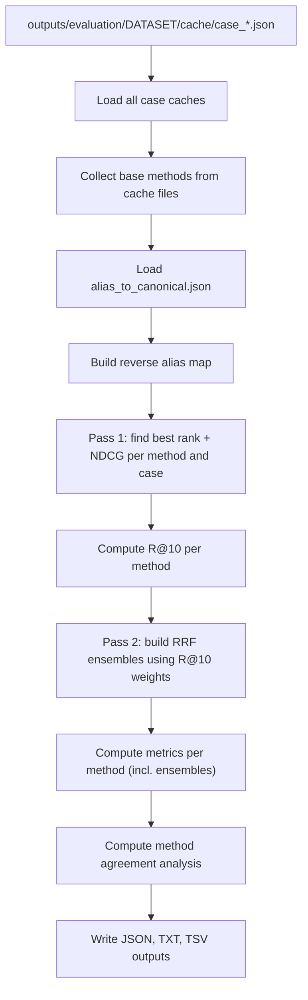

# Evaluator and Metrics

## Purpose

The evaluator reads cached case results and computes evaluation metrics for all detected methods.

File:

```text
scripts/evaluation/evaluator.py
```

The evaluator does not rerun methods. It only reads cache files.

Input:

```text
outputs/evaluation/<DATASET>/cache/case_*.json
```

Outputs:

```text
outputs/evaluation/<DATASET>/<DATASET>_evaluation.json
outputs/evaluation/<DATASET>/<DATASET>_evaluation_summary.txt
outputs/evaluation/<DATASET>/<DATASET>_stats.txt
outputs/evaluation/<DATASET>/<DATASET>_summary.tsv
```

Command:

```bash
python scripts/evaluation/evaluator.py --dataset MME
```

`--dataset` (alias `--datasets`) is required and is the name of the subdirectory under `outputs/evaluation/` to read from and write to — normally the test-set filename stem, or the `--cache-name` value a batch runner was given.

Optional argument:

```text
--top-k
    Cutoff used for Recall@k and NDCG. Default: 10.
```

```bash
python scripts/evaluation/evaluator.py --dataset MME --top-k 20
```

Note that `--top-k` here only changes the NDCG cutoff and the "found within top-k" check used internally for NDCG's ideal-DCG normalization — Recall@1/3/5/10/20 are always reported at those five fixed cutoffs regardless of this flag.


## Evaluator workflow




## Method detection

The evaluator automatically detects the set of *base* methods from:

```python
case.get("results", {}).keys()
```

across all loaded cases (the union, not just the first case). Three additional ensemble methods (`ensemble_rrf`, `ensemble_rrf_weighted`, `ensemble_rrf_top`) are then computed on top of the base methods — see [RRF ensembles](#rrf-ensembles) below.

Because methods are detected from the cache rather than hardcoded, a new method does not need evaluator changes if it writes results in the expected cache format (see [cache-format.md](cache-format.md)).

Before evaluation, `main()` also prints per-method coverage — how many of the loaded cases have that method recorded in `case["methods_run"]` — so it's easy to spot a method that only partially finished a batch run.


## Disease ID matching

The evaluator can extract disease IDs from a result dict using, in order:

```text
disease_id
canonical_disease_id
ordo_id
```

Function:

```python
get_disease_id_from_result(result)
```

This supports the different result schemas written by the various batch runners: `disease_id` for semantic / set-based / tfidf / hpo2vec / autoencoder results, `canonical_disease_id` for transformer results, and `ordo_id` for LLM results.


## Alias matching

The evaluator loads an alias-to-canonical disease ID map via:

```python
load_alias_map()
```

which reads the path given by `raresim.utils.paths.ALIAS_TO_CANONICAL_PATH`. If the file does not exist, the evaluator prints a warning and falls back to direct ID matching only (no alias equivalence).

It then builds a reverse alias map so equivalent disease IDs can match in both directions:

```text
Ground truth:
    OMIM:123456

Method result:
    ORPHA:999

alias_to_canonical:
    OMIM:123456 -> ORPHA:999
```

This should count as correct because both IDs refer to the same disease concept.

Main functions:

```python
load_alias_map()
build_reverse_map(alias_map)
get_all_equivalent_ids(disease_id, alias_map, reverse_map)
find_rank(...)
find_all_matched_ranks(...)
count_distinct_ground_truth(...)
```


## Rank finding

For each case and method, the evaluator finds the *best* rank of any ground-truth disease (or an alias-equivalent ID). This single best rank drives Recall@k, MRR, and median rank, which are all single-best-hit metrics by definition.

Function:

```python
find_rank(ground_truth_ids, results, alias_map, reverse_map)
```

Returns:

```text
rank number
    if a ground-truth disease or an alias-equivalent ID is found

None
    if no ground-truth disease is found
```

A separate function, `find_all_matched_ranks(...)`, returns the ranks of *every* distinct candidate that matches any ground-truth disease (not just the best one). This is used only for NDCG, described next.


## Metrics

The evaluator computes, per method:

```text
Recall@1
Recall@3
Recall@5
Recall@10
Recall@20
MRR
NDCG@10 (or NDCG@top-k if --top-k is overridden)
Found count
Median rank
```

Computed by `compute_metrics(ranks, ndcg_values, top_k)`.

### Recall@k

Fraction of cases where a ground-truth disease (best rank) appears within the top `k`. Reported at k = 1, 3, 5, 10, 20.

### MRR

Mean Reciprocal Rank: `1 / best_rank`, averaged across all cases, using `0` contribution for cases where nothing was found.

Examples:

```text
rank 1    -> 1.0
rank 2    -> 0.5
rank 10   -> 0.1
not found -> 0
```

### NDCG@10

This computes a true multi-relevance NDCG, not a single-hit approximation. Two things distinguish it from a simpler "was it found" score:

- **Every matched ground-truth disease counts, not just the best-ranked one.** If a case has two distinct ground-truth diseases and a method finds both within the top 10, both contribute to the score — not just whichever one ranked higher.
- **Aliases collapse into one relevant item.** Ground-truth IDs that refer to the same underlying disease (per `alias_to_canonical.json`) — for example, an OMIM/ORPHA cross-reference pair — are merged via `count_distinct_ground_truth(...)` before scoring, so a case isn't treated as having two relevant diseases when it really has one.

Per case, `compute_ndcg_for_case(matched_ranks, n_relevant, top_k)` computes:

```text
DCG@k  = sum over matched ranks r <= k of  1 / log2(r + 1)
IDCG@k = DCG of the ideal ordering — all n_relevant ground-truth
         diseases placed at ranks 1..min(n_relevant, k)
NDCG@k = DCG@k / IDCG@k   (0 if IDCG@k is 0, i.e. no ground truth)
```

`matched_ranks` comes from `find_all_matched_ranks(...)` — every matching candidate, not just the best — and `n_relevant` is that case's alias-collapsed ground-truth count, computed once per case since it doesn't depend on which method is being scored.

The reported `NDCG@10` (or `NDCG@top-k`, if `--top-k` is overridden) is this per-case value averaged across all cases.

### Found count

Number of cases where the correct disease (or an alias-equivalent ID) was found by that method, out of `n_cases`.

### Median rank

Median of the best rank across only the cases where the disease was found (cases where nothing was found are excluded, not treated as an infinite rank). With an even number of found cases, the evaluator reports the lower of the two middle values (`found_ranks[len(found_ranks) // 2]`), not an averaged median.


## Timing

Average runtime per method is computed from each case's `method_elapsed_seconds` field, averaged only over the cases that reported timing for that method:

```python
aggregate_method_timing(cases)
```

If a method does not write timing information for a case, that case is simply excluded from the average for that method. If a method never writes timing at all, its average runtime is reported as unavailable (`n/a`) rather than as an error.


## RRF ensembles

The evaluator builds three Reciprocal Rank Fusion ensembles on top of the base methods it detects.

Formula, per case, for a candidate disease `d`:

```text
RRF(d) = sum over methods r of  weight_r / (k + rank_r(d))
```

Default:

```python
RRF_K = 60
```

Generated ensemble methods:

```text
ensemble_rrf
ensemble_rrf_weighted
ensemble_rrf_top
```

Meaning:

```text
ensemble_rrf
    Equal-weight RRF (weight 1.0) using all detected base methods.

ensemble_rrf_weighted
    RRF using all base methods, each weighted by its own Recall@10
    (computed in a first pass over all cases before the ensembles
    are built).

ensemble_rrf_top
    Equal-weight RRF using only the subset of base methods whose
    Recall@10 is >= RRF_MIN_RECALL10.
```

Threshold:

```python
RRF_MIN_RECALL10 = 0.10
```

If no method passes the threshold, `ensemble_rrf_top` falls back to using all base methods. A method with weight `0` (possible for `ensemble_rrf_weighted` if its Recall@10 is exactly 0) contributes nothing to that ensemble's scores.

Each ensemble's own rank and NDCG are computed the same way as for a base method — `find_rank` / `find_all_matched_ranks` are re-applied to the top-`k` RRF-fused results for each case.


## Method agreement analysis

Computed by `compute_agreement(results)` over all methods (base + ensembles):

```text
Consensus cases
    Cases where every method found the correct disease within the
    configured top-k.

Hard cases
    Cases where no method found the correct disease. Listed by case ID.

Easy cases
    Cases where at least one method ranked the correct disease #1.

Unique finds
    Cases where exactly one method found the correct disease. Listed
    with the case ID, ground truth, the method, and its rank.

Found-by-N distribution
    Histogram of how many methods (0..n_methods) found the correct
    disease, per case.

Rank histogram
    How often the correct disease was found at each individual rank,
    across all methods and cases.
```

This helps determine whether methods tend to fail on the same cases (redundant) or solve complementary cases (worth ensembling).


## Output files

### `<DATASET>_evaluation.json`

Machine-readable result file. Top-level keys:

```text
n_cases
n_methods
methods                 (base methods + 3 ensemble methods)
method_metrics          (per method: recall_1/3/5/10/20, mrr, ndcg, found, median_rank)
method_avg_seconds
rank_matrix             (per case: case_index, ground_truth, ranks per method)
rrf_top_methods         (base methods used by ensemble_rrf_top)
rrf_method_weights      (Recall@10 per base method, used as RRF weights)
```

### `<DATASET>_evaluation_summary.txt`

Human-readable summary containing, in order: a method comparison table (Recall@1/3/5/10/20, MRR, NDCG, found count, avg seconds/case, sorted by Recall@10 then MRR), the RRF ensemble configuration, the method agreement analysis, and a per-case rank matrix (`-` marks "not found").

### `<DATASET>_stats.txt`

Compact per-method statistics block (Recall@1/3/5/10/20 with text bars, median rank, avg query time), one block per method, sorted by Recall@10 then MRR.

### `<DATASET>_summary.tsv`

Tab-separated, one row per case per method. Columns:

```text
method
case_id
n_hpo
confirmed_diseases
rank
matched_id
status
query_time_sec
```

`status` is `True`/`False` (found or not). `matched_id` is the disease ID of the result at the matched rank, or `"None"` if the case was not found for that method.
