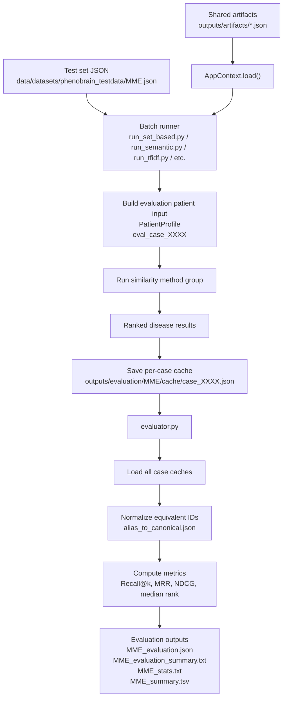
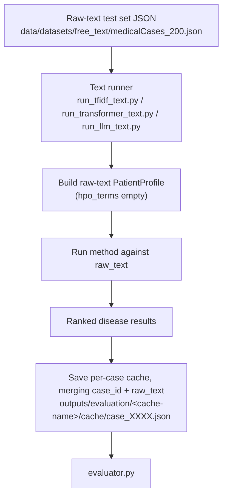

# Evaluation Workflow Overview

## Purpose

The evaluation workflow compares RareSim similarity methods on benchmark test sets.

Three test-set shapes are supported, depending on which runner is used (full schemas in [dataset-format.md](dataset-format.md)):

```text
Standard (HPO-term) cases
    patient HPO terms + ground-truth disease IDs

Raw-text cases
    raw clinical text + ground-truth disease IDs

Negative-aware cases
    patient HPO terms + excluded HPO terms + ground-truth disease IDs
```

Each batch runner processes every case, runs one group of similarity methods, and writes ranked results into per-case cache files. The evaluator then reads those cache files and computes rank-based metrics.

## Evaluation comes after artifact building

Before evaluation, shared artifacts must already exist:

```bash
python raresim/build/load_ontologies_to_local.py
python raresim/build/build_shared_artifacts.py
```

The evaluation runners then load artifacts with:

```python
AppContext.load()
```

The evaluation workflow does not rebuild disease profiles, HPO ancestors, mappings, or information content. It reuses artifacts from:

```text
outputs/artifacts/
```

## Main workflow (HPO-term cases)



Runners that follow this HPO-term path: `run_set_based.py`, `run_semantic.py`, `run_tfidf.py`, `run_hpo2vec.py`, `run_autoencoder.py`, `run_transformer.py`, `run_llm.py`.

## Raw-text workflow

`run_tfidf_text.py`, `run_transformer_text.py`, and `run_llm_text.py` follow the same overall shape, but skip HPO-term propagation (there are no HPO terms — the patient is represented by `raw_text` only) and write into a cache directory named after `--cache-name` if given, so the results can merge into an existing HPO-based dataset's cache or live in their own directory:



Example:

```bash
python scripts/evaluation/run_tfidf_text.py \
    --test-set data/datasets/free_text/medicalCases_200.json \
    --cache-name medical_cases_raw

python scripts/evaluation/evaluator.py --dataset medical_cases_raw
```

## Negative-aware workflow

`run_set_jaccard_penalized.py` runs a single method, `set_jaccard_penalized`, against test cases that also specify HPO terms the patient was explicitly noted **not** to have. By default it targets the cache of the corresponding positive-only dataset (stripping a trailing `_with_excluded` from the filename), so it merges into caches already populated by `run_set_based.py` and the others:

```bash
python scripts/evaluation/run_set_based.py \
    --test-set data/datasets/phenopackets/standardized_to_json/0.1.27.json

python scripts/evaluation/run_set_jaccard_penalized.py \
    --test-set data/datasets/phenopackets/standardized_to_json/0.1.27_with_excluded.json

python scripts/evaluation/evaluator.py --dataset 0.1.27
```

## Output directory

The evaluation output directory is:

```text
outputs/evaluation/
```

It is defined in `_batch_utils.py` as:

```python
EVALUATION_DIR = OUTPUTS_DIR / "evaluation"
```

For a dataset file named `MME.json`, the standard runners save per-case caches under `outputs/evaluation/MME/cache/`, because the dataset name is taken from `test_set_path.stem`. Raw-text and negative-aware runners use `--cache-name` if given, falling back to the same `test_set_path.stem` rule otherwise (or, for `run_set_jaccard_penalized.py`, the filename stem with a trailing `_with_excluded` removed).

## Full command order

```bash
python raresim/build/load_ontologies_to_local.py
python raresim/build/build_shared_artifacts.py

python scripts/evaluation/run_set_based.py --test-set data/datasets/phenobrain_testdata/MME.json
python scripts/evaluation/run_tfidf.py --test-set data/datasets/phenobrain_testdata/MME.json
python scripts/evaluation/run_semantic.py --test-set data/datasets/phenobrain_testdata/MME.json
python scripts/evaluation/run_hpo2vec.py --test-set data/datasets/phenobrain_testdata/MME.json
python scripts/evaluation/run_autoencoder.py --test-set data/datasets/phenobrain_testdata/MME.json

CUDA_VISIBLE_DEVICES=5 python scripts/evaluation/run_transformer.py --test-set data/datasets/phenobrain_testdata/MME.json
CUDA_VISIBLE_DEVICES=5 python scripts/evaluation/run_llm.py --test-set data/datasets/phenobrain_testdata/MME.json

# Optional: penalized Jaccard, if a negative-aware version of the dataset exists
python scripts/evaluation/run_set_jaccard_penalized.py --test-set data/datasets/phenobrain_testdata/MME_with_excluded.json

python scripts/evaluation/evaluator.py --dataset MME
```

For quick testing:

```bash
python scripts/evaluation/run_set_based.py \
    --test-set data/datasets/phenobrain_testdata/MME.json \
    --limit 5

python scripts/evaluation/evaluator.py --dataset MME
```

## Evaluation outputs

For dataset `MME`, the evaluator writes:

```text
outputs/evaluation/MME/MME_evaluation.json
outputs/evaluation/MME/MME_evaluation_summary.txt
outputs/evaluation/MME/MME_stats.txt
outputs/evaluation/MME/MME_summary.tsv
```

See [evaluator-and-metrics.md](evaluator-and-metrics.md) for what each file contains.
