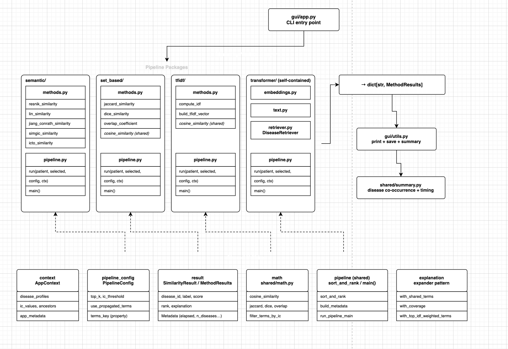

# TODO: Architecture Design

# Current
- Currently we work with Python modules, but for this kind of pipeline with different dependencies, modular algoirhtm swapping, trying to make all methods keeping the same structure with the same entry run() function is here more difficult than working on (abstract) classes and interfaces. 
-> we could make more runner classes for each method
- It would be also more easy to have one single global state manager or something that holds our graph rather than in every script loading it again or passing it over through multiple function calls. -> single responsibility
- No clear place for shared behavior




```
RareSim-Master-Project/
  evaluation/
    evaluator.py
    run_test_files.py
    standardize_phenopackets.py

  experiments/
    text_vs_hpo/
      results/
        experiment_results.json
        summary.txt
      scripts/
        analyze_results.py
        run_experiment.py
      test_data/
        hpo_cases.json
        raw_text_cases.json

  ontologies/
    images/
    lib/
    model/
      disease_to_phenotypic_feature_association.all.tsv
      en_product4_HPO.xml
      hoom.owl
      hpo.obo
      hpo.owl
      mondo_rare.owl
      ordo.owl
      phenotype.hpoa
      phenotype.hpoa.owl
      version.txt

  outputs/
    cache/
    evaluation/
    gui/
    hpo2vec/
    llm/
    semantic/
    set_based/
    shared/
    tfidf/
    transformer/

  src/
    core/
      __init__.py
      config.py
      disease_profiles.py
      graph_builder.py
      graph_resetter.py
      hpo_utils.py
      ic.py
      loaders.py
      mapping_utils.py
      normalizers.py
      phenotype_merge.py
      schemas.py
    gui/
      __init__.py
      app.py
      summary.py
      utils.py
    shared/
      __init__.py
      cache.py
      context.py
      explaination.py
      io.py
      math.py
      methods.py
      paths.py
      phenotype.py
      pipeline.py
      result.py
      timer.py
    similarity_methods/
      llm/
      semantic/
        __init__.py
        methods.py
        pipeline.py
      set_based/
        __init__.py
        methods.py
        pipeline.py
      tfidf/
        __init__.py
        methods.py
        pipeline.py
      transformer/
        __init__.py
        config.py
        methods.py
        pipeline.py
        retriever.py
    build_shared_artifacts.py

  test_data/
    results/
      evaluation/
        HMS_evaluation_summary.txt
        MME_evaluation_summary.txt
    test_cases/
      HMS.json
      LIRICAL.json
      MME.json

  validation_tools/
    datasets/
      PhenoBrainBenchmarkDatasets/
        HMS.json
        LIRICAL.json
        MME.json
        PUMCH_L.json
        PUMCH-ADM.json
        RAMEDIS.json
      example.yml
    dx29_benchmarks/
    dx29_phrank_benchmarks/
    lirical_benchmarks/
    phenobrain_benchmarks/
    phenomizer_benchmarks/
    results/
      mme_results.txt
    tests/
    compare_methods.py
    conftest.py
    run_dx29_phrank.py
    run_dx29_search.py
    run_lirical.py
    run_phenobrain.py
    run_phenomiser.py
    utils.py

  pipeline_draft.drawio
  pyproject.toml
  README.md
  requirements.txt
  requirements_server.txt
  useful_cmd.txt
```


# Proposed

```
RareSim/
  src/
    types/            ← data classes
    utils/
    domain/           ← hpo_graph, loaders, disease_profiles
    similarity_methods/
    core/             ← pipeline main scripts
    gui/

  tests/              ← pytest only, fast, mocked
    unit/
    integration/
    validation_tool/
    evaluation/ 

  scripts/            ← run manually or in batch jobs
    evaluation/       ← evaluate our tool
    validation_tools/ ← test existing tools
    experiments/      ← for testing purposes only
    setup/            ← contains loading/initialization logic, load_ontologies.py ...
    analysis/         ← analyse output data, automated reporting

  data/               ← single source of truth for all data
    ontologies/       ← hpo.owl, ordo.owl, hpoa…
    datasets/         ← HMS.json, MME.json, LIRICAL.json...

  outputs/            ← gitignored, generated artefacts
    validation/
    evaluation/
    gui/
    transformer/
      cache/
    semantic/

  docs/               ← notebooks, pipeline_draft.drawio
    notebooks/        ← juptyner notebooks
  pyproject.toml
  README.md
  .env
```

```
similarity_methods/
  semantic/
    __init__.py          ← exports all semantic methods
    resnik.py            ← class ResnikSimilarity(SimilarityMethod)
    lin.py               ← class LinSimilarity(SimilarityMethod)
    jc.py                ← class JiangConrathSimilarity(SimilarityMethod)
    _graph_utils.py      ← private helpers, underscore = internal only

  set_based/
    __init__.py
    jaccard.py           ← class JaccardSimilarity(SimilarityMethod)
    dice.py              ← class DiceSimilarity(SimilarityMethod)
    _set_utils.py

  tfidf/
    __init__.py
    tfidf.py             ← class TFIDFSimilarity(SimilarityMethod)
    _vectorizer.py

  transformer/
    __init__.py
    transformer.py       ← class TransformerSimilarity(SimilarityMethod)
    retriever.py         ← only transformer needs this
    config.py

  llm/                   ← your new input mode 3
    __init__.py
    llm.py               ← class LLMSimilarity(SimilarityMethod)
```


## Open Question
- Should we keep the modular design working with each method as packages, or refactoring it better to classes and using abstract classes to define contracts / common functionalities (which i see more useful and help us to define new classes less error-proune)


---
- Storing all data into outputs for reuse at the moment
- For evaluation and validation we analyse the outputs data
