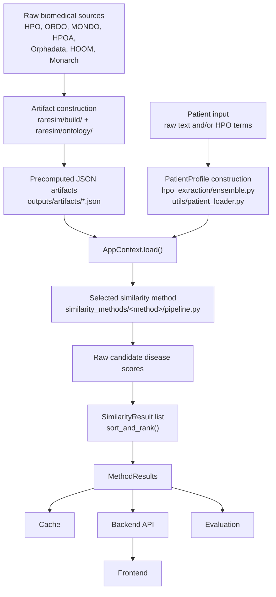
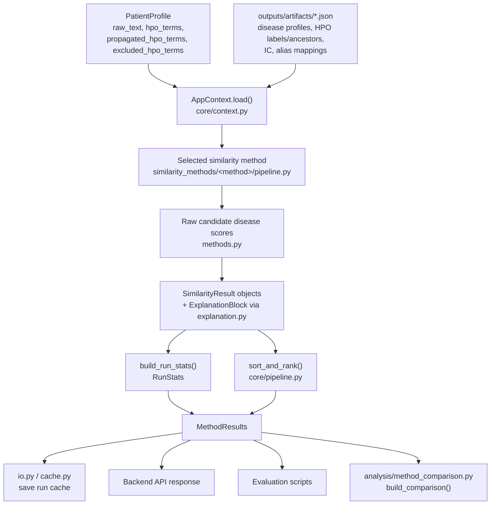

# Architecture Design

## Purpose

This page covers RareSim's overall system architecture: how the codebase is split into packages, how a request flows from raw patient input to a ranked result, and how similarity methods and their results are structured. For the exact build-time artifact mechanics, see the [Artifacts](/artifacts/shared-overview) section; for the offline benchmarking loop, see [Evaluation](/evaluation/workflow-overview); to see how external baseline tools work, see [Validation Tools](/validation/tools-overview); to see how similarity methods work, see [Similarity Methods](/similarity-methods/overview).

## Package Layout

The repository is a small monorepo with four packages plus a scripts directory, alongside data, output, and documentation folders that aren't part of the installable code:

```text
packages/raresim-core       Main RareSim logic: ontology processing, artifact
                             construction, patient/disease representations,
                             HPO extraction, similarity methods, ranking,
                             explanations, caching, method comparison.

packages/raresim-backend    FastAPI layer exposing RareSim over HTTP,
                             used by the Vue frontend.

packages/raresim-frontend   Vue-based frontend: patient input, result
                             display, method comparison.

packages/raresim-cli        Terminal interface offering the same retrieval
                             pipeline as the backend, without a running
                             API server.

scripts                     Evaluation runners, experimental scripts,
                             benchmark visualization, data preparation,
                             validation-tool wrappers.

data                        Datasets for benchmarking, models, ontologies, 
                             patient profiles. 

outputs                     Gitignored. Everything generated at runtime:
                             built artifacts, per-method run caches,
                             evaluation results, benchmark visualization
                             output, and validation-tool results.

docs                        Drawio diagrams, notebooks, and a reference
                             file of useful commands. Supplementary,
                             not the primary documentation.

wiki                        This documentation site.

third_party                 Gitignored. Externally cloned tools (e.g.
                             fast_hpo_cr) that HPO extraction depends on
                             at runtime.
```

Root-level configuration and tooling files:

```text
README.md                    Project entry point.
setup.sh                     Bootstrap script: third-party tools, ontology
                              download, shared artifact build.
pyproject.toml                uv workspace definition (packages/*) plus
                              dev tooling config (e.g. pytest).
pyrightconfig.json           Python type-checker config; points at
                              packages/raresim-core/src.
requirements.txt              General Python dependencies.
requirements_server.txt       CUDA-compatible dependency set for
                              running GPU-backed pipelines (transformer,
                              LLM, autoencoder) on the ifi GPU server.
package.json / package-lock.json
                              Root-level JS tooling — this is for the wiki's
                              own build, not raresim-frontend's dependencies
                              (which has its own package.json).
.gitignore / .gitattributes    Standard git configuration.
```

This separates reusable library code (`raresim-core`) from application code (backend, frontend, CLI), and separates all three from the generated/downloaded material (`data`, `outputs`, `third_party`) that's deliberately kept out of version control. The core package can be used by scripts, the backend, and evaluation tools without depending on the frontend at all. The frontend never touches ontology files, method implementations, or evaluation scripts directly — it only talks to the backend over its API.

## Layered Design and Overall Pipeline

The architecture is layered: raw biomedical resources are converted into reusable artifacts (build-time), patient input is converted into a structured `PatientProfile` (request-time), similarity methods compare that profile against precomputed disease profiles, and results are ranked, explained, cached, and returned via the backend API or consumed directly by the evaluator.



This avoids mixing ontology parsing, patient processing, similarity computation, and UI logic in one place. Each layer communicates with the next through standardized data structures (`PatientProfile`, `DiseaseProfile`, `AppContext`, `SimilarityResult`, `MethodResults`).

## Core Package Architecture

`raresim-core` is organized into eight top-level modules:

```text
types               Central data contracts (PatientProfile, DiseaseProfile,
                     SimilarityResult, MethodResults, RunStats,
                     PipelineConfig, ExplanationBlock).

utils                Shared helpers: paths, JSON I/O, identifier
                     normalization, text preprocessing, similarity
                     mathematics, timing.

build                Entry points driving offline artifact construction —
                     downloading/staging raw ontology sources and
                     assembling the final JSON artifacts.
                     See Artifacts > Shared Overview.

ontology             Converts raw ontology/annotation resources into
                     disease profiles and supporting artifacts.
                     See Artifacts > Disease Profile Construction.

hpo_extraction       Maps patient text to HPO terms.
                     See System > HPO Extraction Pipeline (this section).

core                 Loads artifacts, standardizes pipeline execution,
                     ranks results, generates explanations, handles
                     cache files.

similarity_methods   The actual retrieval methods (set-based, semantic,
                     tfidf, hpo2vec, autoencoder, transformer, llm).

analysis             Cross-method comparison tooling
                     (method_comparison.py).
```

This keeps algorithm-specific logic separate from general infrastructure: a set-based method and a transformer-based method use completely different scoring logic, but both rely on the same `PatientProfile`, `DiseaseProfile`, `AppContext`, result schema, and ranking convention.

## Runtime Pipeline

At runtime, RareSim receives a patient case represented as a `PatientProfile` and compares it against the disease profile collection. Artifacts are loaded once through `AppContext`, giving every method access to the same disease profiles, HPO labels, information content values, HPO ancestors, disease ancestors, disease metadata, and alias mappings.



`AppContext` is a central architectural component: without it, every method would need to load the same artifacts independently, increasing duplication and risking different methods silently using different artifact versions.

The runtime pipeline also uses a shared `PipelineConfig` object, holding settings such as the number of returned candidates, whether propagated terms are used, whether canonical disease profiles are used, and whether information-content filtering is applied — separating method configuration from patient/disease data.

After scoring, shared pipeline logic sorts candidates by decreasing score and assigns ranks. Since ranking assumes higher scores mean stronger similarity, distance-based methods (Jiang-Conrath, the autoencoder's latent Euclidean distance) must convert distance into similarity before results are returned.

## Patient and Disease Profile Architecture

Both sides of a comparison use explicit dataclasses:

```text
PatientProfile   patient_id, raw_text, hpo_terms, propagated_hpo_terms,
                 excluded_hpo_terms

DiseaseProfile   disease identifiers, label, aliases, descriptions,
                 hpo_terms, propagated_hpo_terms, negative_hpo_terms,
                 source identifiers, metadata
```

See [Patient Profile Construction](/artifacts/patient-profile-construction) and [Disease Profile Construction](/artifacts/disease-profile-construction) in Artifacts for the full field lists and the (multiple) functions that build each one.

## Similarity Method Architecture

Each similarity family is a separate module under `similarity_methods`, following a consistent internal structure:

```text
similarity_methods/<family>/
    config.py         Method-specific constants, method names, model
                       paths, default settings.
    methods.py         Low-level scoring functions, model loading,
                       math operations.
    explanation.py      Method-specific explanations, typically via
                       shared explanation helpers in core.
    pipeline.py         Connects the method to the shared runtime
                       pipeline.
    retriever.py         (transformer and LLM families only) higher-level
                       retrieval orchestration beyond direct pairwise
                       scoring.
```

Implemented families: `set_based`, `semantic`, `tfidf`, `hpo2vec`, `autoencoder`, `transformer`, `llm`, plus a shared `registry.py` that organizes available methods so they can be added or selected without hard-coding every method into the main runtime logic.

The extensibility payoff: a new method is a new folder following the same file pattern; as long as it accepts the shared `PatientProfile`, `PipelineConfig`, and `AppContext`, and returns standardized results, it's automatically evaluable and displayable alongside every existing method. See [Adding a New Similarity Method](/similarity-methods/adding-new-method) to add a new similarity method and [Adding a New Evaluation Method](/evaluation/adding-method) to add a batch runner for it.

## Result and Explanation Architecture

All similarity methods, regardless of internal logic, return results through a shared schema.

**Main result objects:**

```text
SimilarityResult   One ranked disease candidate: disease identifier,
                    label, score, method name, rank, aliases, metadata,
                    optional explanation.

MethodResults       Complete output of one method for one patient case.

RunStats             Runtime statistics: term counts, number of scored
                    diseases, skipped diseases, elapsed time.

PipelineConfig       Configuration used during the run.
```

This lets the frontend, backend, cache system, and evaluator consume results without method-specific parsing logic — see [Cache Format](/evaluation/cache-format) for how `MethodResults`/`SimilarityResult` serialize into the per-case JSON cache.

**Explanation schema (`ExplanationBlock`):** summary, coverage block, matched terms, unmatched patient terms, a method-specific field, and diagnostics.

- HPO-based methods populate the coverage block with patient coverage, disease coverage, matched-term counts, and a direction-asymmetry indicator, via helper functions shared across all HPO-based methods.
- Text-based methods populate an analogous token-coverage block (matched tokens, unmatched patient tokens, IDF weights), also via shared helpers.
- LLM-based methods attach natural-language explanations through the method-specific field instead of the structured coverage block.

This matters because interpretability genuinely differs between families: set-based and semantic methods are directly explainable through matched HPO terms, while transformer and autoencoder methods are less transparent since their scores come from dense vector representations the schema can describe but not decompose. Three tiers capture this:

```text
Score-decomposable   Set-based, semantic, TF-IDF — explanation exposes
                     the components that produced the score directly.

Descriptive           Autoencoder, HPO2Vec, transformer — explanation
                     describes representation/measure/model info;
                     matched-term overlap shown is descriptive only,
                     not the score's basis.

Generative             LLM — explanation is a separate model call,
                     produces contextual reasoning + confidence,
                     not a decomposition of the ranking.
```
