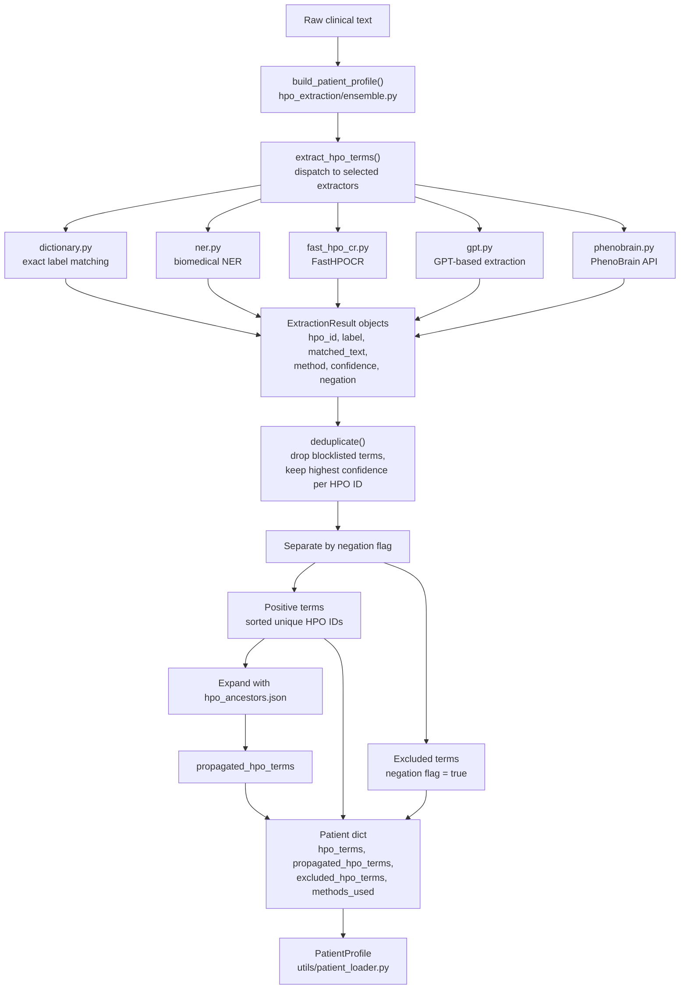

# HPO Extraction Pipeline

## Purpose

The `hpo_extraction` module converts raw patient text into structured phenotype terms. It's kept separate from the similarity methods because extraction is a preprocessing task, not a disease-ranking method — its output becomes part of the `PatientProfile`, usable by any similarity method afterward.

For the confirmed function signatures, extraction method keys, and `skip_negated` behavior, see [Patient Profile Construction](/artifacts/patient-profile-construction) in Artifacts — this page covers the pipeline shape end-to-end at the architecture level.

## Pipeline Flow

