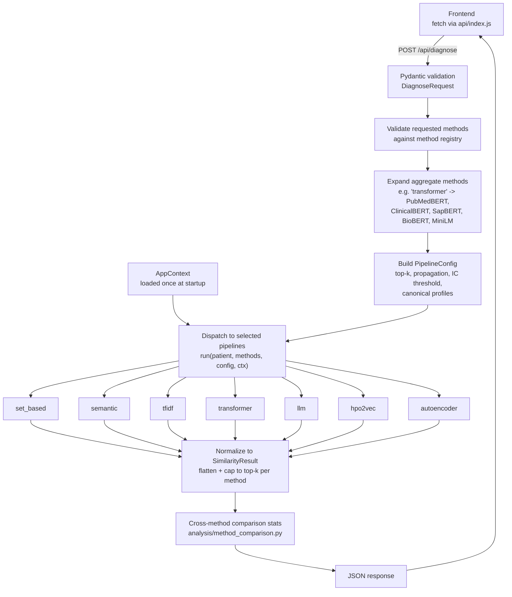
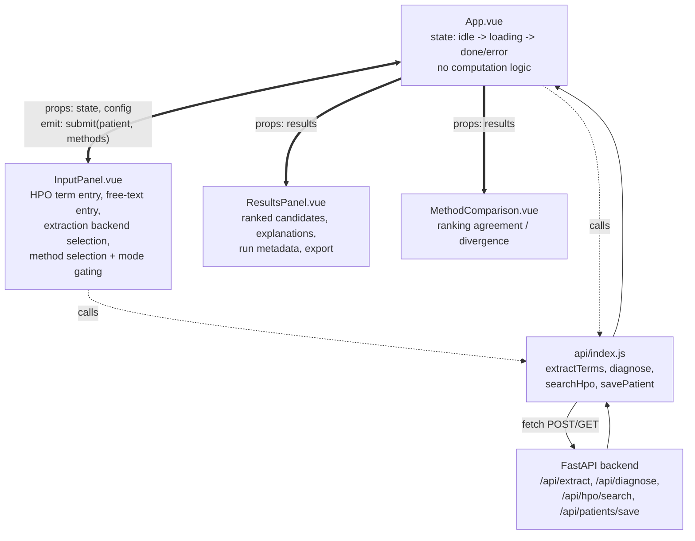

# Web Interface

## Purpose

This page covers the two components that make up RareSim's interactive web interface: the FastAPI **backend** (`raresim-backend`) and the Vue **frontend** (`raresim-frontend`). Together they're one of three ways to run the RareSim pipeline — see [CLI](/system/cli) for the terminal alternative, and [Evaluation](/evaluation/workflow-overview) for the offline batch-runner alternative.

## Backend (FastAPI)

The backend is a FastAPI application (`raresim_api`) exposing a small set of REST endpoints over the shared computational core (`raresim_core`), which implements ontology handling, patient-profile construction, and the similarity-scoring pipelines themselves. This separation lets the same core logic be invoked either through the web API or directly via the CLI.

### API surface

| Endpoint | Purpose |
|---|---|
| `POST /api/extract` | Extracts HPO terms from raw clinical text, using one of five extraction backends (dictionary lookup, biomedical NER, FastHPOCR, GPT-4o-mini, PhenoBrain). |
| `POST /api/diagnose` | Core endpoint. Accepts a patient's HPO terms and/or raw text plus a set of requested similarity methods; returns ranked disease candidates. |
| `POST /api/patients/save` | Persists a patient profile and its diagnosis results to disk, as either a plain JSON record or a Phenopacket. |
| `GET /api/hpo/search` | Substring search over the loaded HPO label index — used for frontend autocomplete. |
| `GET /api/health` | Basic liveness/readiness check. |

Request/response bodies are validated with Pydantic models (`DiagnoseRequest`, `ExtractRequest`, `SavePatientRequest`). Cross-origin requests from the Vite dev server are permitted via FastAPI's CORS middleware.

The extraction backends listed for `/api/extract` correspond exactly to the five method keys documented on [Patient Profile Construction](/artifacts/patient-profile-construction) (`dictionary`, `biomedical_ner`, `fast_hpo_cr`, `chatgpt`, `phenobrain_api`).

### Request flow



This is the same `run(patient, methods, config, ctx)` dispatch pattern used by the [CLI](/system/cli#dispatch) — the backend and CLI are two different callers of an identical dispatch mechanism, not two separate implementations of it.

### Shared application context

At startup, the backend loads ontology-derived artifacts once into memory (HPO labels, term ancestors, information-content values, canonical disease profiles) rather than reloading per request. Per-request state — disease profiles, HPO label/ancestor maps, IC values, disease metadata — is assembled into an `AppContext` object (`raresim.core.context`), threaded through every similarity method call. This is the same `AppContext` documented in [Architecture Design](/system/architecture-design) — the backend is simply one more caller of it, alongside the CLI and the evaluation batch runners.

### Method dispatch

Similarity methods are organized into method groups (semantic, set-based, TF-IDF, transformer, LLM, HPO2Vec, denoising autoencoder), each an independent pipeline module under `raresim.similarity_methods.*` with a common interface:

```python
run(patient, methods, config, ctx)
```

On a `/api/diagnose` request, the backend:

1. Validates requested method identifiers against the method registry.
2. Expands convenience aggregate methods — e.g. a single `"transformer"` selection expands to all configured transformer backbones (PubMedBERT, ClinicalBERT, SapBERT, BioBERT, MiniLM).
3. Dispatches only to the pipelines whose methods were actually selected.
4. Normalizes results from each pipeline into a common `SimilarityResult` shape, flattens into one ranked list, caps to the requested top-*k* per method.
5. Attaches cross-method comparison statistics via `raresim.analysis.method_comparison`.

### Configuration and reproducibility

Each request builds one `PipelineConfig` object (top-*k*, whether propagation to ontology ancestors is applied, the IC threshold for filtering uninformative terms, whether canonical alias-resolved disease profiles are used). Applying the same config across all method pipelines in a request means cross-method comparisons reflect scoring differences, not inconsistent preprocessing.

### Deployment

Served locally via Uvicorn (`uvicorn raresim_api.main:app`), proxied by the Vite dev server so the frontend can issue same-origin API calls during development. See [Deployment & External Dependencies](/system/deployment-and-external-dependencies) for the full local-process picture and how this backend relates to the CLI's independent invocation of the same core package.

## Frontend (Vue)

The frontend is a single-page application built with Vue 3 (Composition API), bundled via Vite. Communicates with the backend exclusively over REST, keeping all similarity computation server-side.

### Component structure

Three top-level components (plus one supplementary view):

```text
App.vue                Root component. Orchestrates application state
                       (idle -> loading -> done/error), mediates data
                       flow between input and results panels. Holds no
                       computation logic — dispatches requests, passes
                       results down as props.

InputPanel.vue          All patient-input concerns: manual HPO term
                       entry (regex-validated against HP:\d{7}),
                       free-text entry with pluggable extraction
                       backends, live phenotype search/autocomplete,
                       inclusion/exclusion term tagging, similarity-
                       method selection with mode-aware method gating
                       (HPO-only methods like Resnik/Lin/Jiang-Conrath
                       BMA and set-based methods are auto-disabled in
                       free-text mode).

ResultsPanel.vue        Renders the ranked disease candidate list:
                       per-result explanations, shared-phenotype
                       highlighting, run metadata (method count,
                       runtime, disease corpus size), patient-record
                       export (JSON or Phenopacket).

MethodComparison.vue    Supplementary view comparing ranking agreement
                       and divergence across multiple methods run
                       within the same query.
```



**Legend:** the thick double-headed arrow between `App.vue` and `InputPanel.vue` carries traffic both ways — props down, `submit` event up. Thick single-headed arrows (`==>`) are props flowing down to the display components. Dotted arrows (`-.->`) are calls out to `api/index.js` and the fetch/response cycle with the backend.

No global state library sits between these components — `App.vue` holds the request/response state directly and passes it down as props, with child components emitting events back up. This is visible in the diagram as the lack of any shared store node: every arrow is either a direct prop/emit between `App.vue` and a child, or a direct call through `api/index.js`.

### Data flow

Backend communication is centralized in one API module (`api/index.js`), wrapping `fetch` in thin `post()`/`get()` helpers and exposing typed functions (`extractTerms`, `diagnose`, `searchHpo`, `savePatient`) matching the FastAPI endpoints one-to-one.

### Build and dev tooling

Vite is both dev server and production bundler. During development, `/api/*` requests are proxied to the FastAPI backend at `http://localhost:8000` (configured in `vite.config.js`), avoiding CORS issues without requiring the backend to implement its own CORS headers for local dev.
