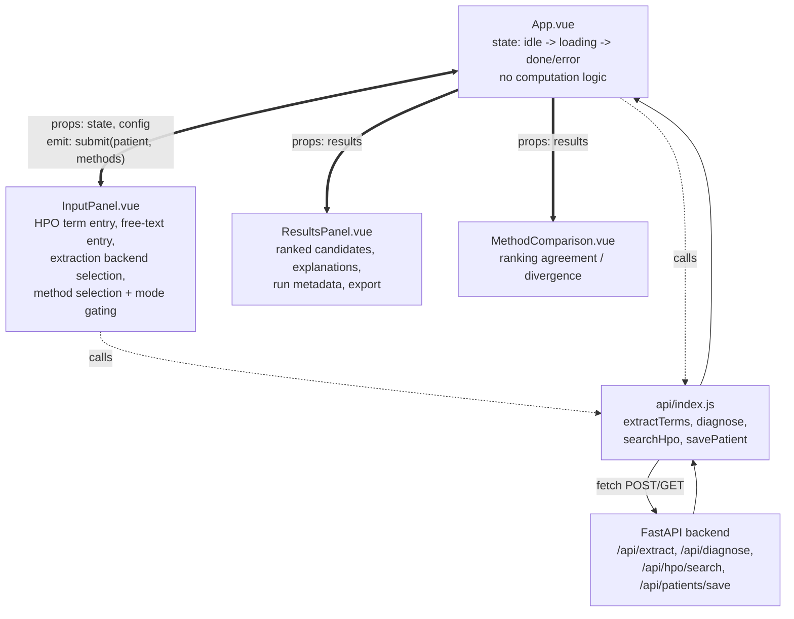

# Web Interface

## Purpose

This page covers the two components that make up RareSim's interactive web interface: the FastAPI **backend** (`raresim-backend`) and the Vue **frontend** (`raresim-frontend`). Together they're one of three ways to run the RareSim pipeline — see [CLI](/system/cli) for the terminal alternative, and [Evaluation](/evaluation/workflow-overview) for the offline batch-runner alternative.

**Terminal 1 — backend:**

Create a `.env` file at the project root with `RARESIM_ROOT=/path/to/RareSim` (see [Installation](/getting-started/installation)), then:
\`\`\`bash
uvicorn raresim_api.main:app --reload --port 8000
\`\`\`

**Terminal 2 — frontend:**
\`\`\`bash
cd packages/raresim-frontend
npm install
npm run dev
\`\`\`
Then open `http://localhost:3000`.

### Configuration and reproducibility

Each request builds one `PipelineConfig` object (top-*k*, whether propagation to ontology ancestors is applied, the IC threshold for filtering uninformative terms, whether canonical alias-resolved disease profiles are used). Applying the same config across all method pipelines in a request means cross-method comparisons reflect scoring differences, not inconsistent preprocessing.

### Deployment

Served locally via Uvicorn (`uvicorn raresim_api.main:app`), proxied by the Vite dev server so the frontend can issue same-origin API calls during development. See [Deployment & External Dependencies](/system/deployment-and-external-dependencies) for the full local-process picture and how this backend relates to the CLI's independent invocation of the same core package.

## Frontend (Vue)

The frontend is a single-page application built with Vue 3 (Composition API), bundled via Vite. Communicates with the backend exclusively over REST, keeping all similarity computation server-side.

| Method | Badge | Notes |
|--------|-------|-------|
| Resnik BMA | IC | Semantic similarity using information content |
| Lin BMA | IC | Lin's normalized semantic similarity |
| JC BMA | IC | Jiang-Conrath semantic similarity |
| Jaccard | set | Set overlap: intersection / union |
| Dice | set | Set overlap: 2 × intersection / (A + B) |
| TF-IDF (HPO) | txt | TF-IDF over HPO term presence — HPO-terms mode only |
| TF-IDF (HPO Labels) | txt | TF-IDF over HPO label text — HPO-terms mode only |
| TF-IDF (Text) | txt | TF-IDF over raw clinical text — raw-text mode only |
| TF-IDF (Hybrid) | txt | Patient HPO labels vs. disease description — both modes |
| Transformer | emb | Sentence transformer embeddings |
| LLM | llm | GPT-based ranking |
| HPO2Vec+ | emb | Node2Vec embeddings on enriched HPO graph |
| Autoencoder | nn | Denoising autoencoder latent space similarity. |

Three top-level components (plus one supplementary view):

```text
App.vue                Root component. Orchestrates application state
                       (idle -> loading -> done/error), mediates data
                       flow between input and results panels. Holds no
                       computation logic — dispatches requests, passes
                       results down as props.

InputPanel.vue          All patient-input concerns: manual HPO term
                       entry (regex-validated against HP:\d{7}),
                       free-text entry with pluggable extraction
                       backends, live phenotype search/autocomplete,
                       inclusion/exclusion term tagging, similarity-
                       method selection with mode-aware method gating
                       (HPO-only methods like Resnik/Lin/Jiang-Conrath
                       BMA and set-based methods are auto-disabled in
                       free-text mode).

ResultsPanel.vue        Renders the ranked disease candidate list:
                       per-result explanations, shared-phenotype
                       highlighting, run metadata (method count,
                       runtime, disease corpus size), patient-record
                       export (JSON or Phenopacket).

MethodComparison.vue    Supplementary view comparing ranking agreement
                       and divergence across multiple methods run
                       within the same query.
```



**Legend:** the thick double-headed arrow between `App.vue` and `InputPanel.vue` carries traffic both ways — props down, `submit` event up. Thick single-headed arrows (`==>`) are props flowing down to the display components. Dotted arrows (`-.->`) are calls out to `api/index.js` and the fetch/response cycle with the backend.

No global state library sits between these components — `App.vue` holds the request/response state directly and passes it down as props, with child components emitting events back up. This is visible in the diagram as the lack of any shared store node: every arrow is either a direct prop/emit between `App.vue` and a child, or a direct call through `api/index.js`.

### Data flow

Backend communication is centralized in one API module (`api/index.js`), wrapping `fetch` in thin `post()`/`get()` helpers and exposing typed functions (`extractTerms`, `diagnose`, `searchHpo`, `savePatient`) matching the FastAPI endpoints one-to-one.

### Build and dev tooling

| Method | Path | Description |
|--------|------|-------------|
| POST | `/api/extract` | Extract HPO terms from clinical text |
| POST | `/api/diagnose` | Run similarity diagnosis |
| GET | `/api/hpo/search?q=` | Search HPO terms by label |
| POST | `/api/patients/save` | Save patient session to disk |
| GET | `/api/health` | Health check |
